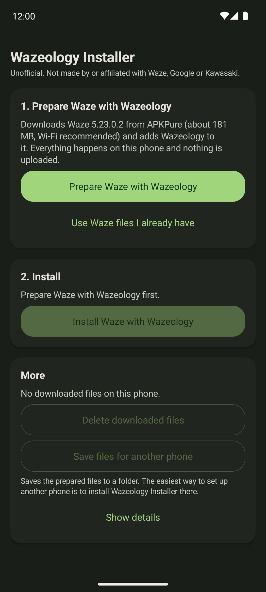

# wazeology

**English** · [Português (Brasil)](README.pt-BR.md)

See Waze's next turn on your Kawasaki's dashboard. Wazeology adds a small piece to the Waze app that sends
each turn to a Rideology-compatible Kawasaki TFT cluster over Bluetooth, so you can ride by the dash with the
phone in your pocket. Waze itself looks and works exactly as before.

*With the next turn on the cluster, you can skip the phone mount. Ride by the dash alone, or pair an intercom for spoken directions too, with the phone locked in your pocket.*

## Table of Contents

- [Is my motorcycle supported?](#is-my-motorcycle-supported)
- [What you need](#what-you-need)
- [Why an installer?](#why-an-installer)
- [Install](#install)
- [If something goes wrong](#if-something-goes-wrong)
- [Updating and removing](#updating-and-removing)
- [Other ways to install](#other-ways-to-install)
- [Safety](#safety)
- [Disclaimer](#disclaimer)
- [License](#license)

## Is my motorcycle supported?

Wazeology talks to the dashboard the same way Kawasaki's Rideology app does, so it connects to any
Rideology-compatible Kawasaki. Only these models can show turn-by-turn directions on the dash, though:

| Model        | Model year |
| ------------ | ---------- |
| Ninja ZX-10R | 2026 -     |
| Z1100        | 2026 -     |
| Z900         | 2025 -     |
| Z900 (70kW)  | 2025 -     |

So far it has only been tested on a Z900 SE. The other models should work the same way, but nobody has
tried them yet. Source: [Kawasaki](https://www.global-kawasaki-motors.com/kawasaki_connect/en/mc.html).

## What you need

- An Android phone running Android 12L or newer. iPhones can't run it.
- About 400 MB of free space, and preferably Wi-Fi: the setup downloads Waze once (about 181 MB).
- One of the motorcycles above.

You don't need a computer; everything happens on the phone.

## Why an installer?

Waze is Google's app, and sharing a modified copy of it isn't allowed, so this project can't publish a
ready-made Waze with Wazeology for you to download. Instead, the Wazeology Installer downloads the regular
Waze from APKPure onto your phone and adds Wazeology to that copy, right there. The Installer carries the
Wazeology changes, not the Waze app itself.

## Install

Most of the setup time is the Waze download.

1. Get the Wazeology Installer. On your phone, open the
   [latest release](https://github.com/agstrc/wazeology/releases/latest) and download
   `wazeology-installer.apk`. Open the downloaded file. Android asks whether your browser (or Files app) may
   install apps: allow it, go back, and tap **Install**.

2. Open **Wazeology Installer**. This is what you'll see:

   

3. Remove the Waze you already have, if any. If the **Waze on this phone** card says Waze is installed
   and offers **Remove current Waze**, tap it and confirm. Android allows only one Waze per phone, and the
   Play Store Waze can't be replaced directly. Your saved places and history come back when you sign in to
   your Waze account again.

4. Tap **Prepare Waze with Wazeology**. The Installer downloads Waze, checks it and adds Wazeology to it. A
   progress bar and a notification show how far along it is. You can turn the screen off or use other apps
   meanwhile. If the connection drops, the download continues on its own when you're back online.

5. Tap **Install Waze with Wazeology** and confirm in the window Android shows.
   - The first time, Android asks you to allow installs from Wazeology Installer. Turn it on and come back;
     the install continues by itself.
   - If Play Protect warns about an unknown app, tap **More details**, then **Install anyway**.
   - On Samsung phones, turn off Auto Blocker first (Settings > Security and privacy > Auto Blocker).

6. Pair your motorcycle. You now have two icons: Waze and Wazeology. Open **Wazeology**, tap
   **Scan for motorcycle**, pick yours and confirm the pairing on the dashboard. Then start a route in Waze,
   and the turns show up on the dash.

To stop the Play Store from replacing it with the regular Waze, open Waze in the Play Store, tap ⋮ and
turn off **Enable auto update**. (On Android 14 and newer, the Play Store has to ask you first anyway.)

## If something goes wrong

The Installer tells you what happened in plain words and shows one button that fixes it, such as
**Try again** or **Remove current Waze**. A few common cases:

- **Couldn't download Waze** or **APKPure isn't responding**: try again later. If it keeps failing, get the
  Waze 5.23.0.2 `.xapk` file (or all of its `.apk` files) some other way, and choose
  **Use Waze files I already have**.
- **Play Protect stopped the install** or **Android blocked the install**: see step 5 above.
- **Another Waze is in the way**: another Waze got installed meanwhile. Tap **Remove current Waze**, then
  install again.

If you need help, open **More** at the bottom of the Installer, tap **Show details**, then **Copy**, and
paste the details into a [GitHub issue](https://github.com/agstrc/wazeology/issues).

## Updating and removing

When a new Wazeology Installer comes out, download it from the
[releases page](https://github.com/agstrc/wazeology/releases/latest) and install it over the old one. It
tells you when your Waze with Wazeology needs an update.

After installing, you can free the space the setup used: in the Installer, open **More** and tap
**Delete downloaded files**. Waze with Wazeology keeps working. To remove everything, uninstall Waze and
Wazeology Installer like any other app.

## Other ways to install

If you have a computer and are comfortable with the command line, you can build Waze with Wazeology yourself
and install it over USB with adb, without the Installer. [`DEVELOPMENT.md`](DEVELOPMENT.md) explains how, and
also covers how everything works under the hood.

## Safety

This project talks to your motorcycle's instrument cluster. Try it off the bike first: with Waze routing
and the bike parked, check that the turns on the dash match the phone. Once you ride with it, treat it like any
other gauge and keep your eyes on the road.

Modifying Waze likely goes against its Terms of Service. If you use Wazeology, you take that risk with your
own phone and your own account.

## Disclaimer

Not affiliated with, endorsed by, or connected to Waze, Google, or Kawasaki. "Waze" and "Kawasaki" are
trademarks of their respective owners, referenced here only to describe compatibility.

The Wazeology Installer published on the releases page contains material derived from one specific Waze
version (modified program code and the app manifest). The Waze app itself is not in it: the Installer downloads
Waze on your phone and modifies that copy. Everything is provided as-is, without warranty, and you
use it at your own risk. The Kawasaki Bluetooth protocol was worked out independently for
interoperability, not taken from Kawasaki documentation or source code.

## License

[Apache-2.0](LICENSE)

The license covers only this repository's own code: the build pipeline, the injected `com.waze.wazeology`
package, and the installer app. It does not, and cannot, license any Waze or Kawasaki material. See the
[Disclaimer](#disclaimer).
