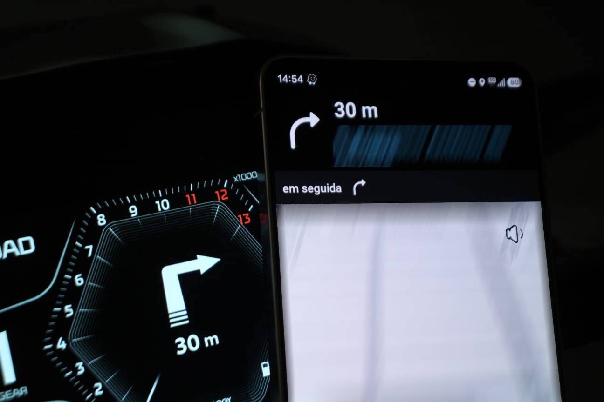

# wazeology

**English** · [Português (Brasil)](README.pt-BR.md)

[](LICENSE)

Patch the Waze Android app to drive a Rideology-compatible Kawasaki BLE5 TFT instrument cluster over BLE.

The patch injects a small package (`com.waze.wazeology`) that reads Waze's live turn-by-turn guidance from
inside the app and pushes Kawasaki `0x14` navigation frames to the cluster. It also adds a **"Wazeology"**
management screen, a second launcher icon, where you scan, pair, connect, and read the log. The build changes
only code and keeps every Waze screen intact, so the app behaves exactly as it did apart from the extra link
to the cluster.



*The next turn shows on the cluster, so you can skip the phone mount: ride by the dash alone, or pair an intercom for spoken directions too, with the phone locked in your pocket.*

## Table of Contents

- [Security](#security)
- [Background](#background)
- [Install](#install)
  - [Dependencies](#dependencies)
- [Usage](#usage)
- [Disclaimer](#disclaimer)
- [License](#license)

## Security

This project drives a vehicle instrument cluster. Test everything off the bike before you rely on it while
riding. `scripts/framecheck.sh` checks the frame byte layouts without any hardware, and the on-device **Log**
shows every cue with its raw hex. Once you do ride with it, treat it like any other gauge and keep your eyes
on the road.

Modifying Waze likely violates its Terms of Service. That risk is yours to take, on your own device and your
own account, and nothing here can waive it for you. Use it at your own risk.

## Background

This is an educational reverse-engineering project for your own devices. The idea is to get Waze's turn-by-turn
guidance onto a motorcycle's factory TFT cluster, the same display Kawasaki's own Rideology app writes to. You
bring your own copy of Waze and your own hardware.

The Kawasaki BLE cluster protocol used here was reverse-engineered independently and tested on real hardware, a
Kawasaki Z900 SE. Since the link speaks the same BLE protocol as Rideology, it should work on any
Rideology-compatible Kawasaki, but the Z900 SE is the only one confirmed so far. Other models and model years
are untested. See [`DEVELOPMENT.md`](DEVELOPMENT.md) for the exact test unit and the market and model-year
caveats.

### See Also

- [`DEVELOPMENT.md`](DEVELOPMENT.md) covers the full decompile, patch, graft, and bundling mechanism, along
  with the Kawasaki BLE5 protocol reference.
- [`CLAUDE.md`](CLAUDE.md) holds the working rules for this repo, including the golden rule about never
  letting apktool rebuild resources.

## Install

wazeology builds and installs entirely through the scripts in `scripts/`. The only thing you install on the
host is Docker; the whole Android toolchain runs inside a pinned image.

```bash
cp .env.example .env       # optional: set DEVICE_SERIAL, download source, etc.
scripts/build-image.sh     # once: build the pinned toolchain image (~1.5 GB first time)
scripts/fetch-apk.sh       # download the pinned Waze 5.23.0.2 (apkeep -> apk/, gitignored)
```

### Dependencies

- Docker is the only host dependency. apktool, the Android build-tools, apkeep, the JDK, and adb all run
  inside the pinned toolchain image that `scripts/build-image.sh` builds.
- An Android device reachable by `adb`, over USB or over your network, for the install step.

A few notes on inputs and reproducibility:

- APKs and keystores are never committed. `fetch-apk.sh` downloads the pinned Waze version, and the debug
  keystore is generated locally the first time you build.
- By default it downloads from apk-pure, which needs no credentials. You can switch to google-play through
  `.env` for a byte-exact copy; that source needs an account email and an AAS token, and `.env.example`
  shows how to set it.
- Versions are pinned for reproducibility: Waze 5.23.0.2, apktool 2.10.0, build-tools 34.0.0, android-34,
  apkeep 1.0.0.

## Usage

Build and install in one shot (fetch is idempotent):

```bash
scripts/all.sh             # fetch -> decompile -> patch -> build -> merge -> install
```

Or step by step:

```bash
scripts/fetch-apk.sh       # apk/base.apk + apk/split_config.*.apk
scripts/decompile.sh       # build/base_apktool
scripts/patch.sh           # inject 4 smali hooks + the launcher <activity>
scripts/framecheck.sh      # off-bike frame byte-layout test
scripts/build.sh           # compile Wazeology package -> dex, graft onto the pristine base
scripts/merge.sh           # bundle base + splits into build/gen/wazeology.apk
scripts/install.sh         # adb install build/gen/wazeology.apk
```

The bundled apk includes every language Waze ships. To include only some, set `LANGS`, for example
`LANGS="pt en" scripts/all.sh` (or `scripts/merge.sh`). The device ABI and screen density are always included.

Then, on the device: open the **Wazeology** icon → **Scan** → tap your motorcycle → accept the passkey on
the cluster. Start a Waze route; turn-by-turn frames flow to the cluster. The in-app **Log** has **Share** /
**Copy** export.

[`DEVELOPMENT.md`](DEVELOPMENT.md) explains how the build works internally: the graft, the smali hooks, the
golden rule about not letting apktool rebuild resources, how the splits are bundled into one apk, and the BLE
protocol itself.

## Disclaimer

Not affiliated with, endorsed by, or connected to Waze, Google, or Kawasaki. "Waze" and "Kawasaki" are
trademarks of their respective owners, referenced here only to describe compatibility.

This repository contains no Waze or Kawasaki code, assets, or data. It ships a build pipeline and a small
injected package that run against your own, legitimately downloaded copy of Waze, which `fetch-apk.sh` fetches
at build time. Nothing proprietary is redistributed. The Kawasaki BLE cluster protocol was reverse-engineered
independently for interoperability, not taken from Kawasaki documentation or source.

## License

[Apache-2.0](LICENSE)

The license covers only this repository's own code: the build pipeline and the injected `com.waze.wazeology`
package. It does not, and cannot, license any Waze or Kawasaki material. See the [Disclaimer](#disclaimer).
