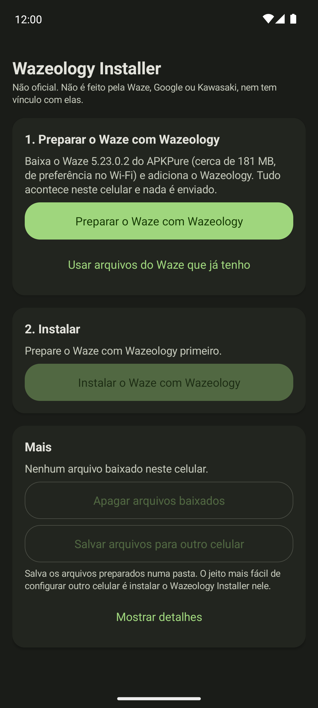

# wazeology

[English](README.md) · **Português (Brasil)**

Veja a próxima curva do Waze no painel da sua Kawasaki. O Wazeology acrescenta uma pequena peça ao app do
Waze que envia cada curva, por Bluetooth, para um painel TFT da Kawasaki compatível com o Rideology. Assim
você pilota olhando o painel, com o celular no bolso. O Waze continua com a mesma cara e funciona como
antes.

*A próxima curva aparece no painel, então dá para dispensar o suporte de celular e pilotar só pelo painel, ou parear um intercomunicador para ouvir também as instruções por voz, com o celular travado no bolso.*

## Sumário

- [A minha moto é compatível?](#a-minha-moto-é-compatível)
- [O que você precisa](#o-que-você-precisa)
- [Instalação](#instalação)
- [Se algo der errado](#se-algo-der-errado)
- [Atualizar e remover](#atualizar-e-remover)
- [Outras formas de instalar](#outras-formas-de-instalar)
- [Segurança](#segurança)
- [Aviso legal](#aviso-legal)
- [Licença](#licença)

## A minha moto é compatível?

O Wazeology conversa com o painel do mesmo jeito que o app Rideology, da Kawasaki, então ele se conecta a
qualquer Kawasaki compatível com o Rideology. Mas só estes modelos conseguem mostrar a navegação curva a
curva no painel:

| Modelo       | Ano-modelo |
| ------------ | ---------- |
| Ninja ZX-10R | 2026 -     |
| Z1100        | 2026 -     |
| Z900         | 2025 -     |
| Z900 (70kW)  | 2025 -     |

Até agora ele só foi testado em uma Z900 SE. Os outros modelos devem funcionar do mesmo jeito, mas ninguém
experimentou ainda. Fonte: [Kawasaki](https://www.global-kawasaki-motors.com/kawasaki_connect/en/mc.html).

## O que você precisa

- Um celular Android com Android 12L ou mais novo. Não funciona em iPhone.
- Cerca de 400 MB livres e, de preferência, Wi-Fi: a instalação baixa o Waze uma vez (cerca de 181 MB).
- Uma das motos da lista acima.

Não precisa de computador: tudo acontece no celular.

## Instalação

A maior parte do tempo vai no download do Waze.

1. Baixe o Wazeology Installer. No celular, abra a
   [versão mais recente](https://github.com/agstrc/wazeology/releases/latest) e baixe o
   `wazeology-installer.apk`. Abra o arquivo baixado. O Android pergunta se o seu navegador (ou o app de
   arquivos) pode instalar apps: permita, volte e toque em **Instalar**.

2. Abra o **Wazeology Installer**. Esta é a tela que você vai ver:

   

3. Remova o Waze que você já tem, se tiver. Se o cartão **Waze neste celular** disser que o Waze está
   instalado e oferecer **Remover o Waze atual**, toque nele e confirme. O Android só permite um Waze por
   celular, e o Waze da Play Store não pode ser substituído direto. Seus lugares salvos e seu histórico
   voltam quando você entrar de novo na sua conta do Waze.

4. Toque em **Preparar o Waze com Wazeology**. O Installer baixa o Waze, confere o download e adiciona o
   Wazeology a ele. Uma barra de progresso e uma notificação mostram quanto falta. Enquanto isso, você pode
   desligar a tela ou usar outros apps. Se a conexão cair, o download continua sozinho quando a internet
   voltar.

5. Toque em **Instalar o Waze com Wazeology** e confirme na janela que o Android mostrar.
   - Na primeira vez, o Android pede para permitir instalações pelo Wazeology Installer. Ative e volte; a
     instalação continua sozinha.
   - Se o Play Protect avisar sobre um app desconhecido, toque em **Mais detalhes** e depois em
     **Instalar mesmo assim**.
   - Em celulares Samsung, desligue antes o Bloqueador automático (Configurações > Segurança e privacidade >
     Bloqueador automático).

6. Pareie a sua moto. Agora você tem dois ícones: Waze e Wazeology. Abra o **Wazeology**, toque em
   **Buscar moto**, escolha a sua e confirme o pareamento no painel. Depois inicie uma rota no Waze, e as
   curvas aparecem no painel.

Para a Play Store não trocar este Waze pelo Waze comum, abra o Waze na Play Store, toque em ⋮ e desligue
**Ativar atualização automática**. (No Android 14 ou mais novo, a Play Store precisa pedir sua confirmação
antes de qualquer forma.)

## Se algo der errado

O Installer explica o que aconteceu em palavras simples e mostra um botão que resolve, como
**Tentar de novo** ou **Remover o Waze atual**. Alguns casos comuns:

- **Não foi possível baixar o Waze** ou **O APKPure não está respondendo**: tente de novo mais tarde. Se
  continuar falhando, consiga o arquivo `.xapk` do Waze 5.23.0.2 (ou todos os arquivos `.apk` dele) de
  outro jeito e escolha **Usar arquivos do Waze que já tenho**.
- **O Play Protect bloqueou a instalação** ou **O Android bloqueou a instalação**: veja o passo 5 acima.
- **Outro Waze está atrapalhando**: outro Waze foi instalado nesse meio-tempo. Toque em
  **Remover o Waze atual** e instale de novo.

Se precisar de ajuda, abra **Mais** na parte de baixo do Installer, toque em **Mostrar detalhes** e depois
em **Copiar**, e cole os detalhes em uma [issue no GitHub](https://github.com/agstrc/wazeology/issues).

## Atualizar e remover

Quando sair um Wazeology Installer novo, baixe-o na
[página de versões](https://github.com/agstrc/wazeology/releases/latest) e instale por cima do antigo. Ele
avisa quando o seu Waze com Wazeology precisa de atualização.

Depois de instalar, você pode liberar o espaço usado na instalação: no Installer, abra **Mais** e toque em
**Apagar arquivos baixados**. O Waze com Wazeology continua funcionando. Para remover tudo, desinstale o Waze
e o Wazeology Installer como qualquer outro app.

## Outras formas de instalar

Se você tem um computador e está acostumado com a linha de comando, pode gerar o Waze com Wazeology por
conta própria e instalar pelo cabo USB com o adb, sem o Installer. O [`DEVELOPMENT.md`](DEVELOPMENT.md)
(em inglês) explica como e também mostra como tudo funciona por dentro.

## Segurança

Este projeto conversa com o painel de instrumentos da sua moto. Teste primeiro sem pilotar: com o Waze
seguindo uma rota e a moto parada, confira se as curvas no painel batem com as do celular. Quando for pilotar
com ele, trate-o como qualquer outro instrumento do painel e mantenha os olhos na estrada.

Modificar o Waze provavelmente viola os Termos de Serviço dele. Quem corre esse risco é você, no seu celular e
na sua conta, e nada aqui tira esse risco de você.

## Aviso legal

Sem afiliação, endosso ou vínculo com Waze, Google ou Kawasaki. "Waze" e "Kawasaki" são marcas registradas de
seus respectivos donos, citadas aqui apenas para descrever compatibilidade.

O Wazeology Installer publicado na página de versões contém material derivado de uma versão específica do
Waze (código de programa modificado e o manifesto do app). O app do Waze em si não está nele: o Installer
baixa o Waze no seu celular e modifica essa cópia. Tudo é fornecido como está, sem garantia, e você usa por
sua conta e risco. O protocolo Bluetooth da Kawasaki foi decifrado de forma independente para fins de
interoperabilidade, e não retirado da documentação ou do código-fonte da Kawasaki.

## Licença

[Apache-2.0](LICENSE)

A licença cobre apenas o código próprio deste repositório: o pipeline de build, o pacote injetado
`com.waze.wazeology` e o app instalador. Ela não licencia, e nem poderia licenciar, nenhum material do Waze
ou da Kawasaki. Veja o [Aviso legal](#aviso-legal).
